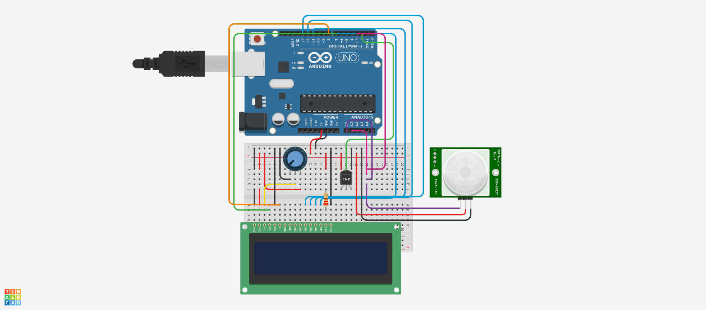
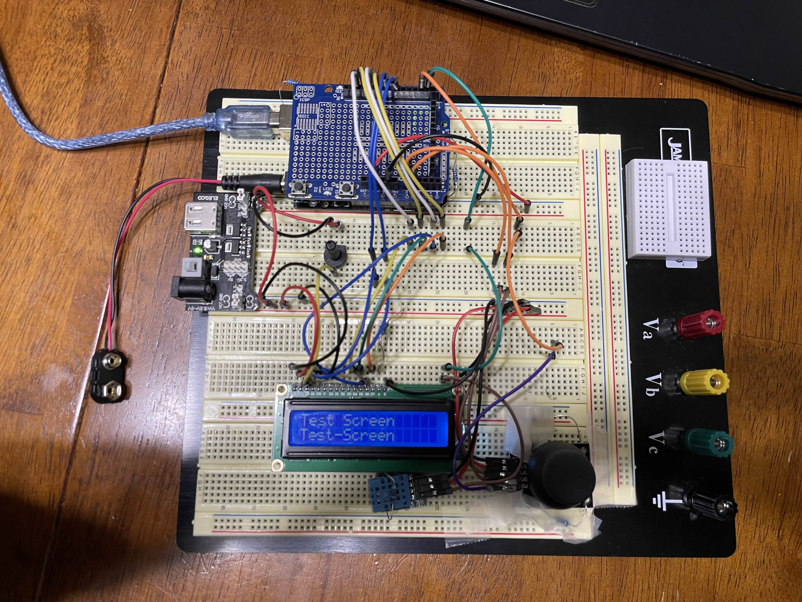

# SSD-Transmission
Secure Sensor Data Transmission between Arduino and PC

### Objective
- This project is restricted to utilizing parts from the [ELEGOO Uno R3 Super Start Kit](https://www.elegoo.com/products/elegoo-uno-r3-super-starter-kit).
- The objective is to develop a system where an Arduino collects environmental data using sensors, encrypts the data using AES encryption, and sends it securely to a PC application over serial communication. The PC application will decrypt the data and display it. - This project combines embedded systems, cryptography, and software development.

## LOG
10/9/2024
- Made the basic circuit design
- Implemented circuit design in real life.
- Used sample code, from ELEGOO to be changed later, that has the DHT11 collect and display temperature and humidity data.
- Successfully tested base circuit.

### Design

Some comments about the above design: Unlike TMP Module here,
DHT11 pins go (in left-right order), DATA, VCC, GND. An analog joystick component wasn't available, so it is represented by a PIR sensor. The GND and PWR pins remain the same (represented as GND and +5V on the analog joystick) and the signal pin represents VRx (Analog A0 pin), VRy (Analog A1 pin), and the SW (Digital 3 Pin).

### Circuit

The Arduino, DHT11 Sensor, and the Analog Joystick were pinned to the bread board just using resistors through the corner holes of the component. A power source supply was added to connect 2 sections of the breadboard for GND and VCC connections.

### Arduino Code and Serial Monitoring

The code for the Arduino can be found [here](/Arduino-Code/SSD-Transmission.ino). The code currently utilizes some example code from the ELEGOO Uno R3 Super Starter Kit to test the LCD screen, analog joystick, and DHT11 sensor.

**Testing the DHT11 Temperature and Humidity Sensing**:

The area I am in initially has a temperature of 26.0 deg. C and a humidity percentage of 48.0%. After placing my finger directly on the DHT11 sensor, the temperature rises to 27.0 deg. C and the humidity percentage rises to 63.0%. This is expected as my body heat and the natural moisture from my finger should increase these values.

**Testing the Joystick directional motion and switch function**:

![14:23:07.432 -> X-axis: 426
14:23:07.432 -> Y-axis: 444
14:23:07.477 -> 
14:23:07.477 -> 
14:23:08.428 -> Switch:  1
14:23:08.428 -> X-axis: 427
14:23:08.428 -> Y-axis: 0
14:23:08.472 -> 
14:23:08.472 -> 
14:23:09.439 -> Switch:  1
14:23:09.439 -> X-axis: 427
14:23:09.439 -> Y-axis: 871
14:23:09.483 -> 
14:23:09.483 -> 
14:23:10.410 -> Switch:  1
14:23:10.442 -> X-axis: 0
14:23:10.442 -> Y-axis: 444
14:23:10.442 -> 
14:23:10.482 -> 
14:23:11.434 -> Switch:  1
14:23:11.434 -> X-axis: 871
14:23:11.434 -> Y-axis: 554
14:23:11.479 -> 
14:23:11.479 -> 
14:23:12.427 -> Switch:  0
14:23:12.427 -> X-axis: 427
14:23:12.474 -> Y-axis: 444](/Serial-Monitoring/JoystickTest.jpg)

The first 2 lines show the Joystic at neutral position. Skipping the empty line (`time -> null`), the next three lines show the joystick extended up, indicated by `Y-axis: 0`. The next three lines show the joystick extended down, indicated by `Y-axis: 871`. The next three lines show the joystick extended left, indicated by `X-axis: 0`. The next three lines show the joystick extended right, indicated by `X-axis: 871`. The next three lines show the joystick pushed down, activating the switch, indicated by `Switch: 0`.